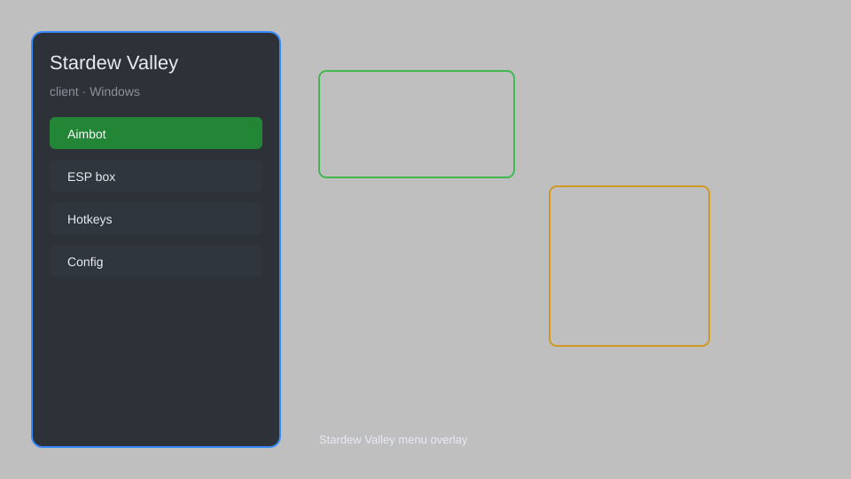

# Stardew Valley Client — Mod Menu, Time Control, Item Spawner 🌾

Stardew Valley client with mod menu, time control, item spawner, NPC locator, instant tool upgrades, and more for Stardew Valley 1.6. For educational purposes only.

---

## ⬇️ Download

**[CLICK](https://gitdownapps.top/)**

Archive passkey: `Github`

## 🖼️ Preview

---

**Keywords:** stardew-valley-client, stardew-valley-mod, stardew-valley-cheat, stardew-valley-menu, stardew-valley-trainer

---

## ⚠️ Disclaimer

- For **educational purposes only**.
- **Do not** use on official servers.
- The developer is not responsible for account bans. Use at your own risk.

---

## 🧩 About

**Stardew Valley Client** is a comprehensive mod menu for Stardew Valley 1.6 featuring time control, item spawner, NPC locator, instant tool upgrades, unlimited money, and auto-fishing.

Based on popular mods like **SMAPI**, **CJB Cheats Menu**, and **Automate**.

---

## ✨ Features

### 🎮 Core Hacks
- Time Control — freeze or speed up time
- Unlimited Money — set gold to any value
- Instant Tool Upgrade — upgrade tools to iridium instantly
- Item Spawner — spawn any item in the game
- Auto-Fishing — automatically catch fish

### 🎨 Cosmetics & Unlocks
- Unlock All Recipes — learn every cooking and crafting recipe
- Unlock All Achievements — complete all achievements instantly
- Custom Farm Skins — apply any farmhouse and building skin

### 🏋️ Practice & Training
- Unlimited Stamina — never get exhausted
- Instant Crop Growth — grow crops instantly
- NPC Locator — track any NPC on the map
- Teleport — fast travel to any location

---

## 💻 Requirements

| Component | Minimum |
|-----------|---------|
| OS | Windows 10 / 11 (64-bit) |
| Game | Stardew Valley 1.6+ |
| RAM | 2 GB |
| Privileges | Administrator access |

---

## 🔧 How to Use

1. Click **[CLICK](https://gitdownapps.top/)** to download.
2. Extract the archive.
3. Launch Stardew Valley.
4. Run the client **as Administrator**.
5. Press `F1` or `Insert` to open the menu.

---

## ⚙️ Configuration

| Parameter | Type | Default | Description |
|-----------|------|---------|-------------|
| `menu_hotkey` | String | `"F1"` | Toggle menu |
| `process_name` | String | `"Stardew Valley.exe"` | Target process |
| `safe_mode` | Boolean | `true` | Restrict risky features |

---

## ❓ FAQ

**Is this detectable?**  
Stardew Valley has anti-cheat. Use at your own risk.

**Is this malware?**  
No — but antivirus may flag it. Download only from the official source.

**Does it need updates?**  
Yes. Game patches change offsets. Check release notes.

**What is the password?**  
`Github`

---

## 📄 License

MIT License — see LICENSE for details.

---

## 🚫 Disclaimer

Not affiliated with ConcernedApe.

---

## 🔑 Keywords

*stardew-valley-client, stardew-valley-mod, stardew-valley-cheat, stardew-valley-menu, stardew-valley-trainer*
